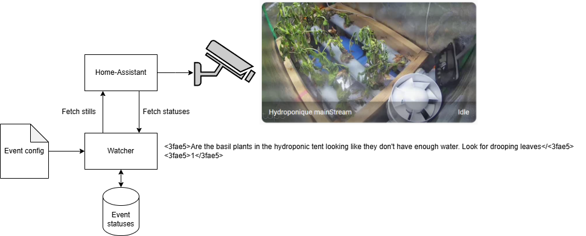
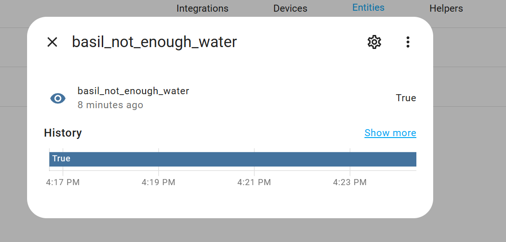

# home-assistant-watcher

Use a VLM to "watch" video stream and alert you of specific things.



Once the API is up and running, add the sensor as REST sensors to your `configuration.yaml`.

```yaml
sensor:
  - platform: rest
    name: "basil_not_enough_water"
    resource: "http://ADDRESS:PORT/streams/camera.hydroponique_mainstream/events/basil_not_enough_water/"
    value_template: "{{ value_json.status == '1' }}"
    scan_interval: 60
```

Reload the config and you should see the integration up and running:

